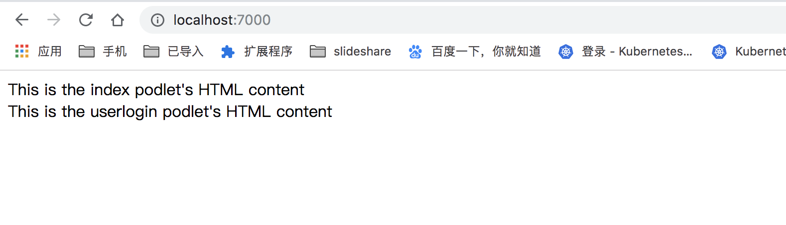

# podium learning

> user docker && docker-compose running

## How to Running

* layouts/home

layouts services

* podlets/indexpage && podlets/userlogin

podlets services indexpage

* Build  Docker image

```code
docker-compose build
```

* Running

```code
docker-compose up -d
```

* View Result

UI:
open  http://localhost:7000

api proxy:

http://localhost:7000/dashboard/podium-resource/userlogin/api

## Some images


